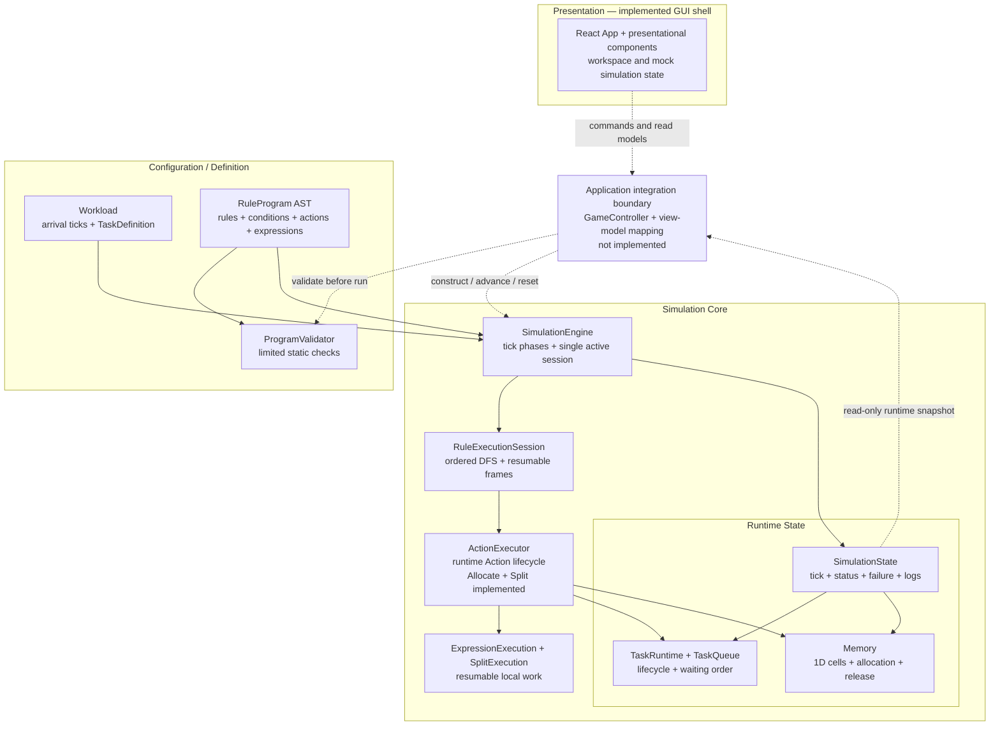

# System Overview

> Status: As-built architecture snapshot with planned boundaries called out explicitly.
>
> Scope reviewed: `MVP.md`, `docs/GUI_MVP.md`, all current `src/` production code and tests, and the design / implementation documents under `docs/superpowers/`.
>
> Current milestone: Split runtime and GUI Phase 1 shell are implemented. Compact has an accepted runtime design, but its Action AST variant, policy/planner, resumable execution, and atomic Memory commit boundary are not yet implemented on the current branch.

## Purpose

This document gives a first-time engineer or AI enough context to locate a change before reading individual classes or methods.

It answers four questions:

1. Which subsystem owns each kind of decision or state?
2. How do definition data, runtime control, and mutable simulation state interact?
3. Which connections exist in the current code, and which are only planned?
4. Where should a new requirement enter the system without crossing an existing boundary?

This is deliberately one level above code. It names stable responsibilities, ownership, dependencies, and flow, but does not attempt class-level UML.

## System Scope

The repository currently contains two implemented but disconnected product slices:

- A deterministic Simulation Core for a one-dimensional memory-management game.
- A React GUI shell that demonstrates the intended workspace, controls, board, and rule-program presentation using mock data.

The intended playable loop is:

```text
Define Workload + Rule Program
→ Validate Program
→ Run deterministic Simulation ticks
→ Observe Memory / Tasks / current execution / failure
→ Reset and revise the Rule Program
```

The current code implements the middle simulation runtime and the visual shell, but not the application layer that joins them. `GameController`, GUI view-model mapping, runtime execution snapshots, and a functional Rule Editor remain future work.

### In scope now

- Fixed `Workload` definitions and Task arrival data.
- A pure-data `RuleProgram` / Expression AST.
- Limited pre-run program validation.
- Deterministic tick progression.
- Waiting, processing, and completed Task runtime state.
- Arrival-order waiting-list scanning without strict head-of-line blocking.
- Ordered, stateful, depth-first, resumable Rule execution.
- One active execution pivot.
- Allocate and multi-tick Split actions.
- One-dimensional Memory with contiguous and fragmented first-fit allocation.
- Failure diagnostics and halt behavior.
- A desktop React presentation shell with mock simulation data.

### Designed or planned, but not implemented

- GameController ownership of Run / Pause / Resume / Step / Reset.
- Validator-to-run wiring.
- GUI-to-Simulation Core integration and runtime view models.
- Read-only current-execution snapshot for UI highlighting.
- Functional Rule Editor that produces a `RuleProgram`.
- Compact Action AST variant, runtime planning, resumable execution, stale-plan re-planning, and atomic Memory commit.
- Automatic simulation completion / win-condition evaluation.
- Score calculation.
- Paging, Virtual Memory, text DSL, compiler, or bytecode VM.

## Architecture at a Glance

Solid arrows below are implemented dependencies or data flow. Dashed arrows are intended integration boundaries that do not yet exist in production code.



The most important architectural fact is the missing dashed bridge: the GUI does not import, construct, validate, advance, or read the `SimulationEngine`. `App.tsx` currently owns mock status, tick, Memory cells, Tasks, and Rule lines.

## Major Components / Subsystems

| Subsystem | Current responsibility | Owns | Does not own |
| --- | --- | --- | --- |
| React GUI shell | Demonstrates the level workspace, navigation, controls, board, and rule-program presentation. | Workspace focus, pin/snap state, mock status/tick/data, presentation composition. | Real Simulation state, Rule execution, validation, Memory mutation. |
| Workload / Task definition | Describes deterministic scenario input before execution. | Arrival tick and immutable Task properties such as size, duration, and splittability. | Waiting order, lifecycle status, remaining duration, allocation state. |
| Rule Program / Expression AST | Describes player-authored logic as pure data. | Triggers, conditions, statement order, actions, and expressions. | Execution cursor, evaluated values, Task/Memory mutation. |
| Program Validator | Performs the static checks currently known before execution. | Recursive Split-expression validation and Math arity checks. | Runtime-state-dependent legality, running the program, halting the engine. |
| Simulation Engine | Coordinates deterministic world progression per tick. | Phase order, mutable `SimulationState`, and the single active Rule session. | UI playback state, Rule editing, AST interpretation details, action-specific algorithms. |
| Rule Execution Session | Interprets matching rules in order with resumable DFS control flow. | Statement/action frame stack, current context Task, suspension and resumption. | Memory algorithms, presentation, global tick scheduling. |
| Action Executor | Adapts an Action AST node to concrete runtime work and state effects. | Action preconditions, ActionExecution lifecycle, Allocate effects, Split delegation. | Rule ordering, IF / ELSE traversal, UI feedback wording. |
| Expression / Split execution | Performs resumable local evaluation and Split planning. | Expression frames/values, `Split.Remaining` snapshot, resolved fragments, physical-cut work. | Global Simulation phases, queue policy, UI state. |
| Simulation State / domain objects | Holds the current mutable world. | Tick, status, Memory, queue, Task runtimes, workload reference, failure, logs. | Rule-definition semantics or presentation policy. |
| Memory | Owns the physical cell array. | Capacity, first-fit placement, atomic fragmented allocation, release, snapshots. | Task lifecycle, Rule flow, future Compaction policy selection. |
| TaskQueue | Stores waiting Task IDs in arrival order. | FIFO storage and stable remove-by-ID behavior. | Choosing actions, allocating Memory, strict head-of-line blocking. |

### Current runtime authority

`SimulationEngine → RuleExecutionSession → ActionExecutor` is the authoritative runtime path used by the engine.

`RuleInterpreter.executeRuleProgram` is a synchronous compatibility / legacy path. It still provides shared condition evaluation, but the engine no longer uses it to execute programs. It cannot correctly represent multi-tick Split or future Compact execution. New runtime behavior should target `RuleExecutionSession`, not create another execution path.

## Definition Data vs Runtime State

Keeping definitions separate from runtime state prevents the editor, scenario data, and execution machinery from becoming one mutable object graph.

| Category | Main types / values | Lifetime and mutation |
| --- | --- | --- |
| Scenario configuration | `Workload`, `WorkloadEntry`, `TaskDefinition`, Memory capacity | Supplied before an engine run; intended to remain stable for that run. |
| Program definition | `RuleProgram`, `Rule`, `Statement`, `Condition`, `Action`, `Expression` | Pure AST data supplied before execution; runtime should not store its cursor inside the AST. |
| World runtime state | `SimulationState`, `Memory`, `TaskQueue`, `Map<TaskId, TaskRuntime>` | Mutates as ticks progress. |
| Per-Task runtime state | `remainingDuration`, `waitingTicks`, `status`, `fragmentSizes` | Created from a `TaskDefinition` on arrival and mutated by world/action progression. |
| Runtime control state | `activeRuleSession`, Rule frames, `ActionExecution`, `SplitExecution`, `ExpressionExecution` | Private resumable execution state; not part of the player-authored program. |
| Diagnostics | `SimulationFailure`, `SimulationLogEntry[]` | Produced during execution; should remain richer than player-facing copy. |
| GUI-local state | workspace progress, pin/snap state, timers, current mock status/tick | Presentation-only state; currently unrelated to the real engine. |

`Workload` and `RuleProgram` are inputs. `TaskQueue` is not a Workload, and a `TaskRuntime` is not a `TaskDefinition`. In particular, an upcoming request becomes a runtime Task only when its arrival tick is processed.

## High-Level Runtime Flow

### Run construction

The current constructor receives:

- a `Workload`;
- a Memory capacity;
- a `RuleProgram` (optional, default empty).

It creates an idle `SimulationState`. The constructor does not invoke `ProgramValidator`; callers can currently construct and start an engine with a program that has not passed validation.

### One Simulation tick

When the engine status is `running`, `runTick()` performs these phases in order:

1. **Processing progression** — decrement every processing Task; completed Tasks release all Memory cells bearing their Task ID.
2. **Arrivals** — instantiate Task runtimes for Workload entries at the current tick and enqueue their IDs.
3. **Waiting / Rule phase** — resume the active Rule session, or scan waiting candidates in arrival order and create a session for an eligible Task.
4. **Waiting metrics** — increment `waitingTicks` for Tasks still waiting in the queue.
5. **Clock advance** — increment the Simulation tick.

If a runtime failure halts the engine during an earlier phase, later phases and the final tick increment do not run.

### Rule-budget behavior

Within phase 3:

- There is at most one active `RuleExecutionSession`.
- Free AST traversal, conditions, literals, references, and zero-cost completion may continue within the same Rule phase.
- The phase stops after one cost-bearing execution step.
- A suspended Action keeps the execution pivot across later Simulation ticks.
- If a candidate's session completes at zero cost and leaves it waiting, scanning can continue to a later waiting Task in the same phase.

This is how the runtime combines arrival-order scanning with no strict head-of-line blocking.

### Action and local execution flow

```text
Rule action statement
→ create ActionExecution
→ advance at most one cost-bearing step
→ preserve local execution state if unfinished
→ commit the Action effect only at its defined boundary
→ return to the parent Rule frame
```

Allocate mutates Memory and Task/queue state on its cost-bearing step. Split instead builds a local fragment plan, consumes expression and physical-cut work across advances, and only then commits `TaskRuntime.fragmentSizes`. Split does not allocate Memory.

## Responsibility Boundaries

### Presentation boundary

The GUI should receive commands and read models from an application/controller layer. It should not mutate `Memory`, `TaskQueue`, `TaskRuntime`, or interpreter frames directly.

The GUI's current `SimulationStatus` includes `paused`; the engine's status deliberately does not. Pause / Resume is expected to mean “stop or resume requesting ticks,” not a mutation of the simulated world.

### Validation boundary

The validator should reject errors knowable from program data before a run. Runtime-dependent failures belong to Expression, Action, Rule-session, or Engine execution and halt through `SimulationFailure`.

Validation success does not mean every runtime action will succeed.

### Interpreter boundary

`RuleExecutionSession` owns control flow: matching Rule order, IF / ELSE selection, statement position, and suspension. It delegates an Action and waits for its result; it should not implement allocation, splitting, or compaction algorithms.

### Action boundary

`ActionExecutor` decides whether an Action may start and how its effect reaches the world. Multi-tick Action-specific work belongs in a dedicated execution object, not in `SimulationEngine` or a special Rule frame.

Detailed Runtime Action ownership, dependency direction, mutation boundaries, extension points, and forbidden coupling are documented in [`01-runtime-action-architecture.md`](./01-runtime-action-architecture.md).

### State / storage boundary

`SimulationEngine` owns the aggregate state and phase order. `Memory` owns physical cells, and `TaskQueue` owns waiting-order storage. Callers should not bypass these APIs by keeping separate mutable copies of the same state.

### Diagnostics boundary

Core failures and logs are diagnostic facts. A future controller/presentation mapper may simplify or hide them for gameplay, but the Core should not reduce diagnostic quality to match UI wording.

## Important Invariants

The following rules are either enforced by current code/tests or explicitly required by the accepted MVP design.

### Simulation and control flow

- World phases execute in deterministic order.
- Only status `running` allows `runTick()` to mutate the world.
- At most one Rule execution pivot is active at once.
- One Simulation tick permits at most one cost-bearing Rule/Action/Expression step.
- Zero-cost traversal may continue until a cost-bearing step, completion, or failure.
- Matching Rules and Statements execute in definition order using depth-first branch traversal.
- Conditions read the state that exists when execution reaches them; earlier committed Actions affect later decisions.
- Runtime failure halts immediately.
- Already committed state is not rolled back after a later failure.

### Tasks, Workload, and waiting order

- Arrival data is definition/configuration; the queue contains only runtime Task IDs.
- A newly arrived Task starts as `waiting`, with `remainingDuration = duration`, `waitingTicks = 0`, and `fragmentSizes = [size]`.
- The queue preserves arrival order, but an unhandled earlier Task does not permanently block later Tasks.
- Allocate is valid only for a waiting Task; success changes it to `processing` and removes it from the queue.
- Processing completion changes the Task to `completed` and releases every Memory cell owned by that Task.
- Task lifecycle status and Memory residency are distinct concepts.

### Memory and Split

- Memory is logically one-dimensional even if the GUI renders a grid.
- Contiguous and fragment placement are deterministic first-fit operations.
- Fragmented allocation is atomic: failure leaves Memory unchanged.
- Split keeps the same Task identity and does not create child Tasks or persistent Fragment IDs.
- Split resolves fragment expressions left to right.
- `Split.Remaining` is a snapshot for one expression and changes only after that fragment resolves successfully.
- Split work remains local until the complete valid fragment plan and physical-cut work finish.
- Split success changes only `fragmentSizes`; it leaves the Task waiting and does not allocate Memory.

### Assumed but not currently enforced globally

- Task IDs should be unique within a Workload. Duplicate arrivals can currently overwrite the Task map entry while leaving duplicate queue IDs.
- Memory occupancy, the Task map, Task status, and queue membership should remain mutually consistent. There is no central state-consistency validator yet.
- A Rule Program should be validated before an engine run. No current production path enforces this sequence.

## Extension Points

| New requirement | Primary subsystem / first files to inspect | Boundary to preserve |
| --- | --- | --- |
| Add a new Action | Start with `docs/architecture/01-runtime-action-architecture.md`, then inspect `rules/Rule.ts`, `actions/ActionExecutor.ts`, usually a dedicated `*Execution.ts`, and relevant validator/tests | Reuse the generic Rule action frame; keep action-local runtime state outside Engine / Session. |
| Implement Compact | `01-runtime-action-architecture.md`, the accepted Compaction design, `rules/Rule.ts`, new policy + execution modules, `Memory` atomic commit, and `ActionExecutor` integration | Keep policy, resumable work, and storage commit separate; do not special-case Compact in Engine / Session. |
| Add an Expression operator/function/reference | `expressions/Expression.ts`, `ExpressionExecution.ts`, `ProgramValidator.ts` | Keep AST data separate from resumable evaluation state and cost semantics. |
| Add a Condition | `rules/Rule.ts`, condition evaluation, validator/editor mapping | Conditions inspect state; they do not mutate it. |
| Change tick phase order | `SimulationEngine.ts` and engine integration tests | Treat as a gameplay semantic change, not a local refactor. |
| Add a workload / level feature | `domain/Workload.ts`, Task definitions, scenario data | Do not store runtime Task state in level definitions. |
| Connect the GUI | Add GameController/application layer, view-model mapping, execution snapshot | Do not let React read private frames or directly mutate Core objects. |
| Add current-execution highlighting | Stable AST/block identity + read-only execution snapshot | Expose observability, not the mutable frame stack. |
| Add Pause / Resume / playback speed | GameController / scheduler above the engine | Do not add wall-clock or UI pause state to deterministic Simulation phases. |
| Add win / score rules | A completion/scoring policy above or beside Engine state | Keep “run completed” separate from score optimization. |
| Add Paging / Virtual Memory | New mapping layer between Task address-space concepts and physical Memory | Do not overload current Task lifecycle or rewrite the Rule runtime solely for storage layering. |

## Things That Should NOT Cross Boundaries

- React components should not import interpreter internals or mutate Core domain objects.
- `SimulationEngine` should not know about React, animation timers, workspace focus, or player-facing copy.
- `Memory` should not evaluate Rules, change Task lifecycle, select a compaction policy, or calculate score.
- `TaskQueue` should not allocate Memory or interpret “first in queue” as mandatory processing eligibility.
- Rule AST nodes should not contain mutable execution cursors, evaluated values, or UI component state.
- `RuleExecutionSession` should not implement Action algorithms.
- `ActionExecutor` should not choose the next Rule, branch, waiting candidate, or Simulation phase.
- Expression evaluation should not directly commit world state.
- Workload preview data should not be treated as the runtime waiting list.
- Full runtime diagnostics should not be used verbatim as the only player-facing failure contract.
- Future UI integration should not infer current execution by inspecting private frame-array shapes.
- Planned features in specs or implementation plans should not be represented as already available runtime behavior.

## How to Place a New Requirement

Use these questions in order:

1. **Is it authored before Run?** Put it in Workload / Task / Rule / Expression definitions and extend validation if possible.
2. **Does it decide when the world advances?** It belongs to GameController or `SimulationEngine`, depending on whether the concern is playback or deterministic phase semantics.
3. **Does it choose Rule control flow?** It belongs to `RuleExecutionSession` or condition evaluation.
4. **Does it implement one Action's work or cost?** Put it in `ActionExecutor` plus a dedicated resumable execution module.
5. **Does it own physical cell integrity?** Put the smallest policy-neutral operation in `Memory`; keep algorithms outside it.
6. **Is it only a visual transformation or interaction?** Keep it in the GUI or a presentation mapper.
7. **Does the GUI need to observe private runtime data?** Add a stable read-only snapshot contract instead of exposing internal frames.

If a requirement seems to belong to several answers, define an explicit data contract between those regions rather than merging their responsibilities.

## Current Implementation / Documentation Mismatches

These are observations, not decisions about which future change is correct.

| Topic | Documents / design intent | Current implementation | Consequence |
| --- | --- | --- | --- |
| GUI integration | `MVP.md` and `GUI_MVP.md` place a GameController between UI and engine. | No GameController exists; `App.tsx` uses mock arrays and its own mock status/tick. | The GUI is not evidence of Core behavior, and Core changes do not appear in the UI. |
| Program validation | The intended run path validates before execution. | `validateRuleProgram` has no production caller. | Invalid AST data can reach the engine if a caller constructs it directly. |
| Validation scope | `MVP.md` lists scope/type/structure errors as pre-run concerns. | The current validator checks Math arity and directly-known Boolean Split literals only. | The validator is an initial boundary, not a complete semantic/type checker. |
| Compact | `MVP.md` and the accepted Compaction design specify a parameterless Compact Action, deterministic Stable Left Pack, moved-Task Tick cost, resumable execution, stale-plan re-planning, and atomic Memory commit. | The current `Action` union still contains only Allocate and Split. No `CompactionPolicy`, `CompactionExecution`, or whole-layout atomic Memory replacement API exists yet. | Compact is architecturally designed, but is not yet representable or executable in the current runtime. |
| Completion / win | `MVP.md` defines completing the Workload without failure as success. | `SimulationStatus` includes `completed`, but the engine never assigns it or evaluates a win condition. | A successful run remains `running` indefinitely unless an external layer decides otherwise. |
| Pause / Resume / Reset | The design assigns these controls to GameController. | The engine exposes `start()` and `runTick()` only; the GUI independently mocks pause/reset. | This is an intentional missing application boundary, not an engine bug by itself. |
| Arrival trigger | `requestArrived` exists as a Trigger and SimulationEvent variant. | Engine arrivals enqueue Tasks but never create a `requestArrived` Rule session; only `taskWaiting` is emitted. | The type is reserved/future-facing rather than functioning gameplay behavior. |
| State-validation phase | `MVP.md` names state validation in the high-level phase direction. | `runTick()` has no separate state-validation pass. | Cross-object consistency relies on local methods and tests. |
| Rule execution path | The architecture calls for resumable execution. | `RuleExecutionSession` is resumable, while `RuleInterpreter.executeRuleProgram` remains as a synchronous Allocate-era path. | Two public-looking execution APIs can drift; only the session path supports current timing semantics. |
| Execution observability | `GUI_MVP.md` requires a read-only current-execution snapshot. | Active session and frames are private; `SimulationState` has no execution snapshot. | Real current-line highlighting cannot be integrated without a new stable contract. |
| Memory summary source | The React split design and most of its plan say `totalBlocks` / `usedBlocks` metadata are authoritative. The plan's final “Expected Result” sentence instead says the summary is derived from cells. | `MemoryArena` receives total/used metadata and derives only free space. | The existing plan contains contradictory wording and should be corrected when that document is next revised. |
| File location in old plan | The Split implementation plan names `src/simulation/rules/ProgramValidator.ts`. | The implemented files live under `src/simulation/validation/`. | Treat the plan path as historical; use the current source layout. |
| Project README | A project overview would normally explain this architecture and setup. | `README.md` is still the default Vite template. | Newcomers must enter through `MVP.md` and this document instead. |

## Architectural Issues Worth Watching

No implementation change is made by this document. The highest-value follow-up concerns are:

1. **Application boundary is absent.** GUI Phase 2 needs an explicit GameController plus read-only presentation models; connecting `App.tsx` directly to mutable engine state would create hard coupling.
2. **The engine exposes live mutable state.** `getState()` returns the actual `SimulationState`, including mutable `Map`, `Memory`, queue, Tasks, logs, and failure. Tests use this to seed scenarios, but production integration needs a disciplined command/read boundary or snapshots.
3. **Execution has two paths.** `RuleInterpreter` and `RuleExecutionSession` share condition logic but differ in timing capabilities. The long-term public runtime entry point should be unambiguous.
4. **Validation is optional and partial.** This becomes more important once Rule data comes from a UI, saved file, or any untyped source.
5. **End-of-run semantics are missing.** The engine cannot currently become `completed`, so a controller cannot rely on Core status for win presentation.
6. **Runtime consistency assumptions are distributed.** Unique Task IDs and agreement between Task status, queue membership, and Memory occupancy are not centrally checked.
7. **UI observability is not yet a contract.** Exposing the current private frame layout would make future refactors expensive; stable node identity and a small execution snapshot should be designed before GUI integration.
8. **Compact is designed but not yet introduced into the runtime.** The accepted design defines the intended AST shape and execution boundaries, but the current branch still lacks the Compact AST variant, policy/planner, resumable execution, and atomic Memory commit API. Implementation should extend the existing Runtime Action spine rather than add Compact-specific control flow to Engine / Session.

## Relevant Source Files

| Area | Files |
| --- | --- |
| GUI composition / mock orchestration | `src/App.tsx`, `src/components/TopBar.tsx`, `src/components/board/*`, `src/components/rules/*` |
| Scenario data | `src/data/prototypeWorkload.ts`, `src/domain/Workload.ts` |
| Task / waiting model | `src/domain/Task.ts`, `src/domain/TaskQueue.ts` |
| Physical Memory | `src/domain/Memory.ts` |
| Aggregate runtime state | `src/simulation/SimulationState.ts`, `src/simulation/SimulationEvent.ts` |
| Tick orchestration | `src/simulation/SimulationEngine.ts` |
| Rule / Action / Condition AST | `src/simulation/rules/Rule.ts` |
| Authoritative resumable Rule runtime | `src/simulation/rules/RuleExecutionSession.ts` |
| Synchronous legacy / compatibility interpreter | `src/simulation/rules/RuleInterpreter.ts` |
| Action runtime | `src/simulation/actions/ActionExecutor.ts`, `src/simulation/actions/SplitExecution.ts` |
| Expression AST / runtime | `src/simulation/expressions/Expression.ts`, `src/simulation/expressions/ExpressionExecution.ts` |
| Static validation | `src/simulation/validation/ProgramValidator.ts` |
| Behavior contracts | Matching `*.test.ts` files, especially `SimulationEngine.test.ts` and `RuleExecutionSession.test.ts` |

## Related Specs / Docs

### Architecture

- `docs/architecture/00-system-overview.md` — this system-level subsystem map, ownership overview, major data/runtime flow, and top-level architecture boundaries.
- [`docs/architecture/01-runtime-action-architecture.md`](./01-runtime-action-architecture.md) — detailed Runtime Action ownership, collaboration, dependency direction, extension points, mutation boundaries, and forbidden coupling.

### Product / Runtime Specs

- `MVP.md` — gameplay and Simulation Runtime semantics; primary product/runtime specification.
- `docs/GUI_MVP.md` — GUI behavior, current Phase 1 boundary, and future runtime-observability needs.

### Feature Designs / Historical Plans

- `docs/superpowers/specs/2026-09-15-react-component-split-design.md` — current React presentational boundaries.
- `docs/superpowers/plans/2026-09-15-react-component-split-implementation-plan.md` — historical extraction plan; implementation is complete.
- `docs/superpowers/plans/2026-09-11-feat-split-action.md` — design-to-implementation record for the current resumable Split runtime.
- `docs/superpowers/specs/2026-09-16-compaction-runtime-action-design.md` — accepted Compact architecture and invariants. The current branch has not yet implemented the Compact AST/runtime described there.

## Verification Snapshot

The original system-overview review recorded the following automated-suite result:

```text
11 test files passed
99 tests passed
```

That recorded result verified the behavior present at the time of the original review. This documentation-only revision did not re-run the suite. It does not verify the planned GUI integration, GameController, Compact runtime, completion logic, or scoring features listed above.
