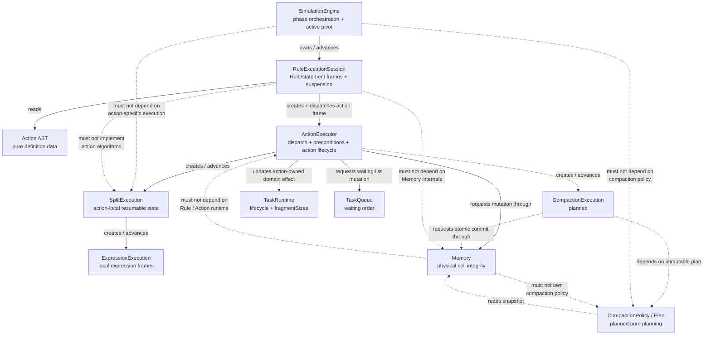
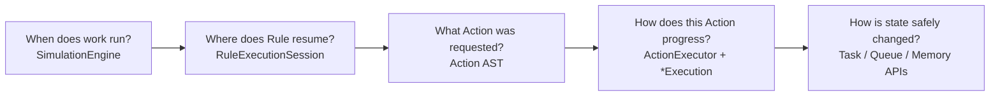

# Runtime Action Architecture

> Status: As-built architecture snapshot with planned Runtime Action boundaries called out explicitly.
>
> Scope reviewed: current `feat/compaction-action` repository state, `MVP.md`, Simulation Engine / Rule Runtime / Action Runtime / Memory code and tests, `docs/superpowers/specs/2026-09-16-compaction-runtime-action-design.md`, and `00-system-overview.md`.
>
> Important snapshot note: the accepted Compaction design describes the intended second resumable Runtime Action, but the GitHub branch reviewed here does not yet contain `compact` in `Action`, `CompactionExecution`, `CompactionPolicy`, or the planned atomic Memory replacement API. Those relationships are therefore marked as **planned**, not implemented.

## Purpose

This document defines the architectural boundary around **Runtime Actions** in the Simulation Core.

Its primary question is:

> **How should Runtime Action components collaborate, and where should each responsibility live?**

It is intended to be read before adding or modifying an Action. A first-time engineer or AI should be able to use it to answer:

- which files are normal extension points;
- which component owns control flow versus action semantics versus storage integrity;
- where resumable action-specific state belongs;
- how a Runtime Action is allowed to request domain mutation;
- which dependencies should point inward or downward;
- which implementation details must not leak upward into the Engine or Rule Session;
- which existing implementation details are temporary or potentially boundary-sensitive.

This is not class-level UML. It documents ownership, dependency direction, collaboration, extension seams, and forbidden coupling.

---

## Runtime Action Architectural Role

A Runtime Action is the boundary between:

```text
player-authored Rule intent
        ↓
resumable runtime work
        ↓
validated domain mutation
```

The Rule AST describes **what Action was requested**. The Rule execution machinery decides **when that Action receives the single execution pivot**. The Action runtime decides **how that Action progresses and when its effect is committed**. Domain objects decide **whether the requested storage mutation is valid and how internal state is physically changed**.

The authoritative runtime path is:

```text
SimulationEngine
→ RuleExecutionSession
→ ActionExecutor / ActionExecution
→ action-specific execution state
→ domain mutation boundary
```

For the currently implemented Split path:

```text
SimulationEngine
→ RuleExecutionSession
→ ActionExecutor
→ SplitExecution
→ TaskRuntime.fragmentSizes commit
```

For Allocate:

```text
SimulationEngine
→ RuleExecutionSession
→ ActionExecutor
→ Memory.allocateFragments(...)
→ TaskRuntime status change
→ TaskQueue removal
```

The accepted Compact design extends the same spine rather than introducing a second runtime mechanism:

```text
SimulationEngine
→ RuleExecutionSession
→ ActionExecutor
→ CompactionExecution          [planned]
→ CompactionPolicy / Plan      [planned]
→ Memory atomic commit API     [planned]
```

The architectural goal is that adding a new Action should normally extend the lower half of this chain without changing the upper half.

---

## Key Components

| Component | Architectural responsibility | Owns | Must not own |
| --- | --- | --- | --- |
| `SimulationEngine` | Deterministic Simulation phase orchestration and ownership of the single active Rule execution pivot. | Tick phase order, aggregate `SimulationState`, active `RuleExecutionSession`, halt transition. | Action algorithms, Action-specific resumable fields, Split/Compact planning, AST action dispatch details. |
| `RuleExecutionSession` | Ordered, depth-first, resumable Rule control flow. | Rule/statement frames, current Rule ID, current context Task ID, Action frame lifetime, suspend/resume position. | Allocation policy, Split evaluation algorithm, Compaction planning, Memory layout algorithms, Simulation phase scheduling. |
| `Action` definition | Pure player-authored Action intent in the Rule AST. | Serializable Action parameters only. | Mutable runtime cursor, execution counters, cached plans, world state references. |
| `ActionExecutor` | Adapter between generic Rule action frames and concrete Action runtime behavior. | Action dispatch, action-level preconditions, creation/advancement of `ActionExecution`, final Action-level commit coordination, normalized failure result. | Rule ordering, IF/ELSE traversal, waiting-candidate selection, Simulation tick loop, storage internals. |
| `ActionExecution` | Generic tagged wrapper for in-progress Action work. | Which concrete Action execution is active and any minimal generic lifecycle state. | Rule frame stack, Simulation phases. |
| `SplitExecution` | Split-specific resumable local work. | Expression progress, `Split.Remaining`, resolved fragment plan, physical cut work. | Rule traversal, queue scanning, Memory allocation, global Tick ownership. |
| `CompactionExecution` | **Planned:** Compact-specific resumable work. | Current immutable plan, already-paid moved Task IDs, re-planning state, next cost-bearing movement step. | Rule traversal, player policy selection UI, raw mutable Memory cells. |
| `CompactionPolicy` / `CompactionPlan` | **Planned:** pure compaction policy and immutable plan data. | Snapshot-to-plan transformation and policy invariants. | Tick scheduling, Rule context, direct Memory mutation. |
| `Memory` | Physical cell storage and policy-neutral storage integrity. | Cell array, allocation/release operations, atomic validity of any future whole-layout replacement. | Rule evaluation, Action control flow, compaction policy, Task lifecycle, scoring. |
| `TaskRuntime` | Runtime Task lifecycle and logical allocation shape. | `status`, `remainingDuration`, `waitingTicks`, `fragmentSizes`. | Rule execution cursor or Memory cell ownership algorithm. |
| `TaskQueue` | Waiting-order storage. | FIFO storage and remove-by-ID behavior. | Allocation, Action dispatch, eligibility policy, compaction. |

---

## Runtime Action Dependency / Collaboration Diagram

Solid arrows represent current implemented collaboration. Dashed arrows represent accepted/planned Compact boundaries. Red `must not depend on` arrows are architecture constraints, not runtime calls.



### Reading the diagram

The upper runtime layers decide **who runs next**. The lower Action layers decide **what one Action does**. Domain objects decide **how their own state remains valid**.

The most important dependency rule is:

```text
control flow depends on Action abstraction
Action runtime depends on domain APIs
domain storage does not depend back on Rule runtime
```

Action-specific implementation detail should therefore flow downward from `ActionExecutor`, not upward into `RuleExecutionSession` or `SimulationEngine`.

---

## Small Responsibility Diagram



The rule of thumb is:

> **Engine schedules. Session interprets. Action runtime executes. Domain objects protect state.**

---

## Responsibility Ownership

### `SimulationEngine`

`SimulationEngine` owns global Simulation-time semantics.

It is responsible for:

- processing world phases in deterministic order;
- resuming the one surviving `RuleExecutionSession`, if one exists;
- selecting a new waiting candidate only when no active pivot remains;
- respecting the one cost-bearing Rule-work step per Simulation Tick;
- converting Rule-session failure into global Simulation halt state;
- advancing processing Tasks, arrivals, waiting metrics, and the Simulation clock.

It should treat an Action as opaque runtime work surfaced through `RuleExecutionSession` results such as:

```text
progress
complete
failure
consumedTick
```

It should not know whether the active Action is Allocate, Split, Compact, or a future Action.

A new Action should not require a new `SimulationEngine` branch unless the feature changes global Simulation phase semantics rather than Action semantics.

### `RuleExecutionSession`

`RuleExecutionSession` owns the single Rule execution pivot.

It is responsible for:

- matching Rules for the current event;
- maintaining statement frames;
- evaluating IF/ELSE control flow;
- preserving Rule ID and context Task ID;
- creating a generic Action frame through `createActionExecution(...)`;
- repeatedly delegating that frame to `advanceActionExecution(...)`;
- keeping the frame alive while the Action reports progress;
- popping it after completion;
- preserving Action identity in failures;
- allowing zero-cost traversal to continue in the same Rule phase.

It is **not** the place to add fields such as:

```text
splitRemaining
compactMovedTaskIndex
allocateAttempted
copyCursor
policyState
```

Those fields are Action-specific execution state and belong below the Session boundary.

### `ActionExecutor`

`ActionExecutor` is the Runtime Action integration boundary.

Its real role is not merely “a switch over Action types.” It is the adapter that translates:

```text
Action AST + Runtime Context
```

into:

```text
ActionExecution lifecycle + legal domain effects
```

It owns four concerns:

1. **Dispatch** — identify the concrete Action type.
2. **Action-level preconditions** — reject starts that are illegal for that Action and current Task/context.
3. **Execution lifecycle** — create and advance the correct resumable execution object.
4. **Commit coordination** — when local work is complete, request the corresponding domain mutation through the owning domain API.

It should remain thin enough that substantial multi-step algorithms live in dedicated `*Execution` / planner modules.

For a future Action, `ActionExecutor` should normally gain one new tagged execution variant and one creation/advancement branch. It should not absorb the full algorithm merely because it is the dispatch point.

### Action-specific execution state

Action-specific resumable state belongs in a dedicated execution object when any of the following are true:

- the Action can suspend across Simulation Ticks;
- it has local partial work that must not yet be committed;
- it needs an evaluation cursor or plan cursor;
- it needs to remember cost already paid;
- it must detect stale world state before commit;
- its algorithm is independently testable.

Current example:

```text
SplitExecution
- remaining
- resolvedFragments
- nextExpressionIndex
- currentExpression
- physicalCutsRemaining
```

Planned Compact example:

```text
CompactionExecution
- current CompactionPlan
- already-paid moved Task IDs
- next pending movement unit
```

These values must not be encoded in the Rule AST or stored in `SimulationEngine`.

### Domain mutation ownership

Runtime Actions may request mutations, but the component that owns the data must own the storage rule.

Examples:

- Memory cell placement goes through `Memory`.
- Waiting-order mutation goes through `TaskQueue`.
- Task lifecycle / fragment shape changes happen on `TaskRuntime` at the Action commit boundary.

A Runtime Action must not keep a second mutable copy of Memory or bypass `Memory` by editing its cell array.

For future whole-layout operations such as Compact, `Memory` should expose the **smallest policy-neutral atomic mutation primitive** needed to preserve storage integrity. It should not receive the compaction algorithm itself.

---

## Dependency Direction

The intended dependency direction is:

```text
SimulationEngine
    ↓
RuleExecutionSession
    ↓
ActionExecutor
    ↓
action-specific execution / planning
    ↓
domain mutation APIs
```

Definition data is read by runtime layers:

```text
Rule Program / Action AST
          ↓
RuleExecutionSession / ActionExecutor
```

Domain state is mutated downward through explicit APIs:

```text
ActionExecutor / dedicated execution
          ↓
TaskRuntime / TaskQueue / Memory
```

The reverse direction should not exist:

```text
Memory ─X→ ActionExecutor
TaskQueue ─X→ RuleExecutionSession
SplitExecution ─X→ SimulationEngine
CompactionPolicy ─X→ Rule AST
```

### Why this direction matters

This keeps the execution model extensible:

- Engine timing remains stable while Actions evolve.
- Rule control flow remains stable while Action algorithms evolve.
- Storage APIs remain reusable while policies evolve.
- Tests can isolate policy, execution, action integration, session behavior, and full Engine behavior separately.

The accepted Compact design deliberately follows this layering: pure policy → immutable plan → resumable execution → atomic Memory commit.

---

## Extension Points

### Primary Runtime Action extension seam

For a genuinely new Action, inspect these locations first:

1. `src/simulation/rules/Rule.ts`
   - add the pure AST variant and parameters;
2. `src/simulation/actions/ActionExecutor.ts`
   - add Action start validation;
   - add an `ActionExecution` variant;
   - delegate advancement;
3. `src/simulation/actions/<NewAction>Execution.ts`
   - when the Action has resumable or algorithmic local work;
4. the owning domain object
   - add only the policy-neutral mutation primitive required by the Action;
5. `src/simulation/validation/ProgramValidator.ts`
   - add checks knowable before runtime;
6. tests at the same layers.

Normally, **do not edit `SimulationEngine.ts` or the generic Action frame logic in `RuleExecutionSession.ts`** just to add another Action.

If a new Action requires either file to understand the Action by name, first ask whether Action-specific responsibility is leaking upward.

### Extension seam for policy-driven Actions

If the Action contains a replaceable algorithm or policy, separate:

```text
policy / planner
→ immutable plan
→ resumable execution
→ domain commit
```

Compact is the reference design for this pattern.

A future selectable or player-authored policy should plug in above `CompactionPlan`, not replace `RuleExecutionSession` or `Memory`.

### Extension seam for new cost models

Cost-bearing work belongs to the runtime node that performs the meaningful work.

Examples:

- Expression operators/functions charge cost in Expression execution.
- Split physical cuts charge cost in `SplitExecution`.
- Compact moved-Task work is planned to charge cost in `CompactionExecution`.

The Engine only enforces the global Rule-work budget. It should not calculate Split or Compact cost itself.

---

## Invariants

### Global execution invariants

- There is at most one active Rule execution pivot.
- One Simulation Tick permits at most one cost-bearing Rule/Expression/Action execution step.
- Zero-cost traversal may continue until the current Rule phase reaches cost-bearing progress, completion, or failure.
- An unfinished Action remains owned by its Action frame and resumes later.
- A completed cost-bearing Action does not allow further Rule work in the same Simulation Tick.
- Runtime failure halts the Simulation immediately.
- Previously committed state is not rolled back after a later failure.

### Rule / Action boundary invariants

- `RuleExecutionSession` knows an Action's identity but not its algorithm.
- `ActionExecutor` knows the current context Task and world state needed by the Action, but does not select the next Rule or waiting candidate.
- Action-specific resumable state is not stored in the AST.
- Local partial work is not world state until the Action's commit boundary.

### Split invariants

- Split local work is isolated until all expressions and physical-cut work succeed.
- Split success changes `TaskRuntime.fragmentSizes` only.
- Split does not allocate Memory and does not remove the Task from the waiting queue.
- Split expression evaluation proceeds left to right.
- `Split.Remaining` is a per-expression snapshot and changes only after a fragment resolves successfully.

### Allocate invariants

- Allocate is valid only for a waiting Task.
- Memory allocation uses `task.fragmentSizes`.
- Fragmented allocation is atomic from the caller's perspective.
- Only after Memory allocation succeeds does the Action change Task status to `processing` and remove it from the queue.

### Planned Compact invariants

- Compaction planning is pure and deterministic.
- Stable Left Pack policy is not embedded in `Memory`.
- Plan data is immutable local execution state.
- Memory remains unchanged before the final valid commit.
- A changed source snapshot invalidates the stale plan and triggers deterministic re-planning.
- Already-paid moved Task IDs are not charged twice in one Compact execution.
- Memory commit is atomic and rejects a stale expected source.
- Compact does not change Task identity, lifecycle status, queue membership, or `fragmentSizes`.

---

## Forbidden Coupling / Architecture Boundaries

## Do Not

### Engine boundary

**Do not put Action-specific algorithms in `SimulationEngine`.**

Examples of forbidden Engine knowledge:

```text
if action is split ...
if compact has 2 moved tasks ...
compact policy = stable-left-pack
split remaining = ...
```

The Engine may know whether Rule work consumed the Tick; it should not know why.

### Session boundary

**Do not add one Rule frame type per Action implementation detail.**

The generic Action frame is the extension point. `RuleExecutionSession` should not gain `splitFrame`, `compactFrame`, or per-Action cursor fields merely to support new Actions.

**Do not let `RuleExecutionSession` mutate Memory directly.**

It owns control flow, not action effects.

### ActionExecutor boundary

**Do not let `ActionExecutor` choose Rule order, waiting candidates, or Simulation phases.**

**Do not grow large action algorithms inline in the dispatcher.**

A switch branch should normally validate, construct/delegate, and coordinate commit—not become the implementation of a multi-Tick algorithm.

### Action-specific execution boundary

**Do not let `SplitExecution`, `CompactionExecution`, or future execution objects control the Rule stack or Simulation clock.**

They report progress/cost; upper layers decide what that means for scheduling.

**Do not commit partial local plans merely because some work has been paid.**

If the Action contract defines atomic commit, keep work local until the commit boundary.

### Memory boundary

**Do not embed Action or policy semantics in `Memory`.**

`Memory` may know:

- capacity;
- cells;
- first-fit placement;
- allocation/release integrity;
- validity of a future atomic whole-layout replacement.

It should not know:

- what Rule caused a mutation;
- which Task owns the execution pivot;
- how many Ticks Compact should cost;
- which compaction policy was selected;
- whether a Rule should continue after the mutation;
- player-facing failure wording.

### Definition/runtime boundary

**Do not store mutable runtime execution state inside Action AST nodes.**

The AST must remain pure definition data. No runtime counters, evaluated values, frame pointers, plan cache, or Memory snapshots belong there.

### Domain duplication boundary

**Do not maintain parallel mutable representations of the same authoritative state.**

In particular:

- do not mirror Memory cells inside an Action execution object and mutate both;
- do not treat queue order and an Action-local waiting list as two sources of truth;
- do not use a Split plan as if it were already committed Task state.

### Presentation boundary

**Do not add UI animation, player-facing wording, or editor concerns to Runtime Action execution.**

The Core should expose stable diagnostic facts and committed state. Presentation decides how those facts are shown.

---

## How to Add a New Runtime Action

Use this sequence before editing code.

### 1. Define semantic ownership

Ask:

- What world state does the Action conceptually affect?
- Which object owns that state?
- Is the Action immediate or resumable?
- Does it need local uncommitted work?
- Is there a policy/algorithm that should be independently replaceable?
- Which errors are statically knowable versus runtime-only?

### 2. Add pure Action definition data

Add only the parameters the Rule needs to express intent.

Example shape:

```ts
{ type: 'newAction', ...parameters }
```

Do not add runtime fields.

### 3. Define or reuse a dedicated execution object

If the Action can span Ticks, create:

```text
<NewAction>Execution
```

It should contain only the local state required to resume the Action.

### 4. Integrate through `ActionExecutor`

Add:

- start validation;
- `ActionExecution` tagged variant;
- creation logic;
- advancement delegation;
- commit coordination;
- normalized failure propagation.

Keep the generic Session API unchanged unless the Action reveals a genuinely missing generic capability.

### 5. Mutate through the owning domain boundary

If the Action changes Memory, request that mutation through `Memory`.

If the required API would force `Memory` to understand Action policy, redesign the boundary: add a smaller policy-neutral primitive instead.

### 6. Preserve one-pivot / one-budget semantics

The Action must report whether one cost-bearing step was consumed. It must not advance the global clock itself.

### 7. Test from narrowest boundary outward

Recommended order:

```text
pure policy / planner test            (if any)
→ action-specific execution test
→ domain mutation API test
→ ActionExecutor test
→ RuleExecutionSession test
→ SimulationEngine integration test
```

A new Action should not be considered integrated merely because an Engine test passes. Each layer should have a focused contract.

### 8. Check the “files that should not change” list

For most new Actions, review whether you can avoid changing:

```text
SimulationEngine.ts
RuleExecutionSession.ts generic control-flow structure
TaskQueue.ts
unrelated Action execution modules
GUI code
```

If several of these must change, document why the requirement is cross-cutting rather than silently spreading Action logic.

---

## Current Implementation Observations

These are observations about the reviewed repository state, not automatic instructions to refactor immediately.

### Observation 1 — the generic execution spine is already real

The current Split implementation demonstrates the intended layering:

```text
RuleExecutionSession
→ create / advance ActionExecution
→ SplitExecution
→ local result
→ ActionExecutor commits Task fragmentSizes
```

This means the existing architecture already supports a multi-Tick Action without adding Split-specific control flow to `SimulationEngine`.

That is the strongest existing evidence for the boundary described in this document.

### Observation 2 — Allocate still has a compatibility/immediate path

`ActionExecutor` currently exposes both:

```text
executeAction(...)
createActionExecution(...)
advanceActionExecution(...)
```

Allocate's resumable path delegates its world effect back through the older immediate `executeAction(...)` helper and uses a `started` flag to model one-Tick cost.

This works and is covered by tests, but it means there are currently two Action-facing APIs inside the module. New multi-Tick Actions should target the `ActionExecution` lifecycle rather than create another immediate execution path.

### Observation 3 — Allocate coordinates several domain mutations

On Allocate success, `ActionExecutor` performs:

```text
Memory.allocateFragments(...)
TaskRuntime.status = 'processing'
TaskQueue.remove(taskId)
```

This makes `ActionExecutor` the current transaction-like coordination boundary for the Allocate effect.

The ordering is important: Memory allocation succeeds before lifecycle and queue mutation occur. The Memory operation itself is atomic with respect to fragmented placement.

There is no general transaction object or aggregate-state consistency validator, so this consistency currently depends on Action code and tests.

### Observation 4 — `SplitExecution` holds a live `TaskRuntime` reference

`SplitExecution` stores the current `TaskRuntime` as execution context. It uses that context for expression evaluation and Task metadata, while the actual `fragmentSizes` commit remains in `ActionExecutor`.

This is not currently violating the observed behavior, but future Action-specific execution objects should avoid mutating unrelated world state through captured references. Treat such references as execution context unless the Action's boundary explicitly assigns commit ownership there.

### Observation 5 — `RuleInterpreter` remains a second synchronous path

The current Engine runtime is driven through `RuleExecutionSession`; the synchronous `RuleInterpreter.executeRuleProgram` path is not capable of representing the same resumable multi-Tick semantics.

New Runtime Actions should not be implemented twice merely to preserve this older path. The authoritative extension seam is the Session → ActionExecution path.

### Observation 6 — Compaction design is ahead of the reviewed branch implementation

The accepted Compact spec defines:

- parameterless `{ type: 'compact' }` AST;
- `CompactionPolicy`;
- immutable `CompactionPlan`;
- resumable `CompactionExecution`;
- stale-plan re-planning;
- one Tick per moved Task ID;
- atomic Memory replacement guarded by expected-source validation.

However, the reviewed `feat/compaction-action` branch currently contains only Allocate/Split Action variants and no compaction runtime modules or atomic Memory replacement API.

Therefore this document shows Compact as the **accepted target boundary**, not as current production behavior.

### Observation 7 — `00-system-overview.md` and current branch are temporarily inconsistent

`00-system-overview.md` describes Compact as already representable in the Action AST with an unimplemented runtime placeholder. The reviewed GitHub branch's `Rule.ts` does not yet contain the Compact variant.

Until the branch and architecture overview are synchronized, engineers should verify the actual branch before assuming Compact syntax is available.

---

## Relevant Source Files

| Area | Source files |
| --- | --- |
| Tick / phase orchestration | `src/simulation/SimulationEngine.ts` |
| Aggregate runtime state | `src/simulation/SimulationState.ts` |
| Rule / Action AST | `src/simulation/rules/Rule.ts` |
| Authoritative resumable Rule runtime | `src/simulation/rules/RuleExecutionSession.ts` |
| Legacy / synchronous Rule path | `src/simulation/rules/RuleInterpreter.ts` |
| Runtime Action integration | `src/simulation/actions/ActionExecutor.ts` |
| Split local execution | `src/simulation/actions/SplitExecution.ts` |
| Expression runtime used by Split | `src/simulation/expressions/ExpressionExecution.ts` |
| Physical Memory owner | `src/domain/Memory.ts` |
| Task runtime state | `src/domain/Task.ts` |
| Waiting-order storage | `src/domain/TaskQueue.ts` |
| Static pre-run validation | `src/simulation/validation/ProgramValidator.ts` |

### Relevant tests

- `src/simulation/actions/ActionExecutor.test.ts`
- `src/simulation/actions/SplitExecution.test.ts`
- `src/simulation/rules/RuleExecutionSession.test.ts`
- `src/simulation/SimulationEngine.test.ts`
- `src/domain/Memory.test.ts`
- expression / validation tests related to Split semantics

These tests are part of the architecture contract: they verify not only output values, but when effects become visible, which layer owns suspension, and whether failures leave committed/uncommitted state consistent.

---

## Related Specs

- `MVP.md`
  - Runtime cost model;
  - one Execution Pivot;
  - Rule/Action responsibility split;
  - Split semantics;
  - Compaction MVP semantics;
  - strict failure / no rollback of already committed state.

- `docs/architecture/00-system-overview.md`
  - higher-level subsystem ownership;
  - Engine → Session → Action runtime authority;
  - definition/runtime separation;
  - system-wide extension points and current mismatches.

- `docs/superpowers/plans/2026-09-11-feat-split-action.md`
  - historical implementation path that established resumable Action execution.

- `docs/superpowers/specs/2026-09-16-compaction-runtime-action-design.md`
  - accepted Compact policy/execution/commit boundary;
  - immutable planning;
  - stale-plan re-planning;
  - atomic Memory commit;
  - required tests by layer.

- `docs/superpowers/plans/2026-09-16-compaction-runtime-action-implementation-plan.md`
  - referenced by `00-system-overview.md`, but not present on the reviewed GitHub branch path at the time of this snapshot.

---

## Architecture Checklist Before Merging a New Action

A Runtime Action change is architecturally aligned when the answers below are all clear:

- [ ] The AST contains definition data only.
- [ ] `SimulationEngine` does not know the new Action's algorithm.
- [ ] `RuleExecutionSession` still uses the generic Action frame.
- [ ] `ActionExecutor` is the integration / dispatch boundary.
- [ ] Multi-Tick local state lives in a dedicated execution object.
- [ ] Policy logic is separated from execution if it may evolve independently.
- [ ] Domain mutation goes through the object that owns the data.
- [ ] Memory policy is not embedded inside `Memory` merely for convenience.
- [ ] One advance consumes at most one Rule-work Tick.
- [ ] Partial local work is not exposed as committed Simulation state unless explicitly designed that way.
- [ ] Runtime failure preserves already committed state and does not commit incomplete local work.
- [ ] Unit tests exist below the Engine integration layer.
- [ ] Any change to Engine / generic Session logic is justified as a generic runtime capability, not as an Action special case.

If the last item cannot be satisfied, treat that as an architecture design event rather than a routine Action addition.
